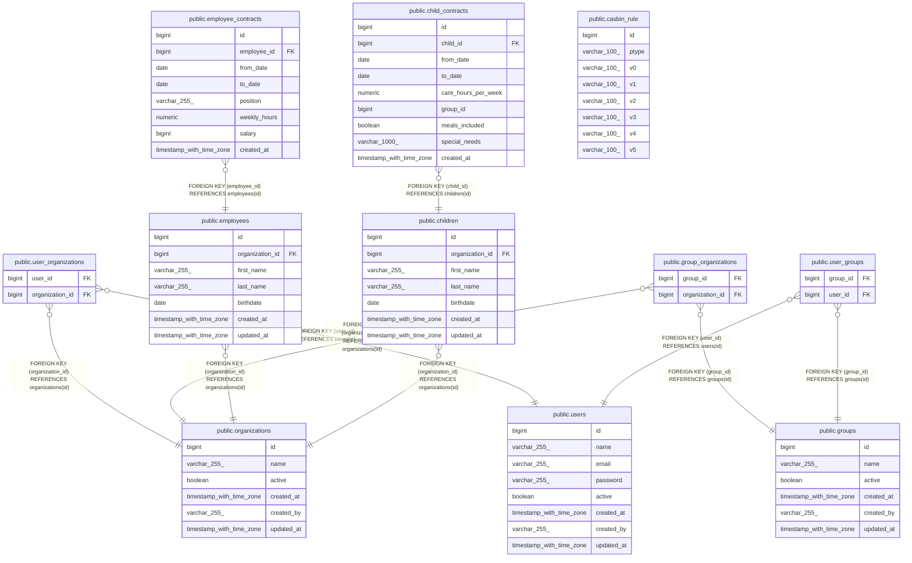

# kitamanager

## Tables

| Name                                                        | Columns | Comment | Type       |
| ----------------------------------------------------------- | ------- | ------- | ---------- |
| [public.organizations](public.organizations.md)             | 6       |         | BASE TABLE |
| [public.users](public.users.md)                             | 8       |         | BASE TABLE |
| [public.user_organizations](public.user_organizations.md)   | 2       |         | BASE TABLE |
| [public.groups](public.groups.md)                           | 6       |         | BASE TABLE |
| [public.group_organizations](public.group_organizations.md) | 2       |         | BASE TABLE |
| [public.user_groups](public.user_groups.md)                 | 2       |         | BASE TABLE |
| [public.employees](public.employees.md)                     | 7       |         | BASE TABLE |
| [public.employee_contracts](public.employee_contracts.md)   | 8       |         | BASE TABLE |
| [public.children](public.children.md)                       | 7       |         | BASE TABLE |
| [public.child_contracts](public.child_contracts.md)         | 9       |         | BASE TABLE |
| [public.casbin_rule](public.casbin_rule.md)                 | 8       |         | BASE TABLE |

## Relations

---

> Generated by [tbls](https://github.com/k1LoW/tbls)
