# kitamanager

## Tables

| Name                                                                            | Columns | Comment | Type       |
| ------------------------------------------------------------------------------- | ------- | ------- | ---------- |
| [public.payplans](public.payplans.md)                                           | 4       |         | BASE TABLE |
| [public.payplan_periods](public.payplan_periods.md)                             | 6       |         | BASE TABLE |
| [public.payplan_entries](public.payplan_entries.md)                             | 5       |         | BASE TABLE |
| [public.payplan_properties](public.payplan_properties.md)                       | 7       |         | BASE TABLE |
| [public.organizations](public.organizations.md)                                 | 9       |         | BASE TABLE |
| [public.users](public.users.md)                                                 | 10      |         | BASE TABLE |
| [public.groups](public.groups.md)                                               | 8       |         | BASE TABLE |
| [public.user_groups](public.user_groups.md)                                     | 5       |         | BASE TABLE |
| [public.employees](public.employees.md)                                         | 7       |         | BASE TABLE |
| [public.employee_contracts](public.employee_contracts.md)                       | 9       |         | BASE TABLE |
| [public.children](public.children.md)                                           | 7       |         | BASE TABLE |
| [public.child_contracts](public.child_contracts.md)                             | 11      |         | BASE TABLE |
| [public.casbin_rule](public.casbin_rule.md)                                     | 8       |         | BASE TABLE |
| [public.fundings](public.fundings.md)                                           | 4       |         | BASE TABLE |
| [public.funding_periods](public.funding_periods.md)                             | 6       |         | BASE TABLE |
| [public.funding_entries](public.funding_entries.md)                             | 5       |         | BASE TABLE |
| [public.funding_properties](public.funding_properties.md)                       | 7       |         | BASE TABLE |
| [public.government_fundings](public.government_fundings.md)                     | 4       |         | BASE TABLE |
| [public.government_funding_periods](public.government_funding_periods.md)       | 6       |         | BASE TABLE |
| [public.government_funding_entries](public.government_funding_entries.md)       | 5       |         | BASE TABLE |
| [public.government_funding_properties](public.government_funding_properties.md) | 7       |         | BASE TABLE |

## Relations

```mermaid
erDiagram

"public.payplan_periods" }o--|| "public.payplans" : "FOREIGN KEY (payplan_id) REFERENCES payplans(id) ON DELETE CASCADE"
"public.payplan_entries" }o--|| "public.payplan_periods" : "FOREIGN KEY (period_id) REFERENCES payplan_periods(id) ON DELETE CASCADE"
"public.payplan_properties" }o--|| "public.payplan_entries" : "FOREIGN KEY (entry_id) REFERENCES payplan_entries(id) ON DELETE CASCADE"
"public.organizations" }o--o| "public.payplans" : "FOREIGN KEY (payplan_id) REFERENCES payplans(id)"
"public.organizations" }o--o| "public.payplans" : "FOREIGN KEY (payplan_id) REFERENCES payplans(id)"
"public.organizations" }o--o| "public.government_fundings" : "FOREIGN KEY (government_funding_id) REFERENCES government_fundings(id)"
"public.groups" }o--|| "public.organizations" : "FOREIGN KEY (organization_id) REFERENCES organizations(id)"
"public.user_groups" }o--|| "public.users" : "FOREIGN KEY (user_id) REFERENCES users(id)"
"public.user_groups" }o--|| "public.groups" : "FOREIGN KEY (group_id) REFERENCES groups(id)"
"public.employees" }o--|| "public.organizations" : "FOREIGN KEY (organization_id) REFERENCES organizations(id)"
"public.employee_contracts" }o--|| "public.employees" : "FOREIGN KEY (employee_id) REFERENCES employees(id)"
"public.children" }o--|| "public.organizations" : "FOREIGN KEY (organization_id) REFERENCES organizations(id)"
"public.child_contracts" }o--|| "public.children" : "FOREIGN KEY (child_id) REFERENCES children(id)"
"public.funding_periods" }o--|| "public.fundings" : "FOREIGN KEY (funding_id) REFERENCES fundings(id) ON DELETE CASCADE"
"public.funding_entries" }o--|| "public.funding_periods" : "FOREIGN KEY (period_id) REFERENCES funding_periods(id) ON DELETE CASCADE"
"public.funding_properties" }o--|| "public.funding_entries" : "FOREIGN KEY (entry_id) REFERENCES funding_entries(id) ON DELETE CASCADE"
"public.government_funding_periods" }o--|| "public.government_fundings" : "FOREIGN KEY (government_funding_id) REFERENCES government_fundings(id) ON DELETE CASCADE"
"public.government_funding_entries" }o--|| "public.government_funding_periods" : "FOREIGN KEY (period_id) REFERENCES government_funding_periods(id) ON DELETE CASCADE"
"public.government_funding_properties" }o--|| "public.government_funding_entries" : "FOREIGN KEY (entry_id) REFERENCES government_funding_entries(id) ON DELETE CASCADE"

"public.payplans" {
  bigint id
  varchar_255_ name
  timestamp_with_time_zone created_at
  timestamp_with_time_zone updated_at
}
"public.payplan_periods" {
  bigint id
  bigint payplan_id FK
  date from_date
  date to_date
  varchar_1000_ comment
  timestamp_with_time_zone created_at
}
"public.payplan_entries" {
  bigint id
  bigint period_id FK
  bigint min_age
  bigint max_age
  timestamp_with_time_zone created_at
}
"public.payplan_properties" {
  bigint id
  bigint entry_id FK
  varchar_255_ name
  bigint payment
  numeric requirement
  varchar_500_ comment
  timestamp_with_time_zone created_at
}
"public.organizations" {
  bigint id
  varchar_255_ name
  boolean active
  bigint payplan_id FK
  timestamp_with_time_zone created_at
  varchar_255_ created_by
  timestamp_with_time_zone updated_at
  bigint funding_id
  bigint government_funding_id FK
}
"public.users" {
  bigint id
  varchar_255_ name
  varchar_255_ email
  varchar_255_ password
  boolean active
  boolean is_superadmin
  timestamp_with_time_zone last_login
  timestamp_with_time_zone created_at
  varchar_255_ created_by
  timestamp_with_time_zone updated_at
}
"public.groups" {
  bigint id
  varchar_255_ name
  bigint organization_id FK
  boolean is_default
  boolean active
  timestamp_with_time_zone created_at
  varchar_255_ created_by
  timestamp_with_time_zone updated_at
}
"public.user_groups" {
  bigint user_id FK
  bigint group_id FK
  varchar_50_ role
  timestamp_with_time_zone created_at
  varchar_255_ created_by
}
"public.employees" {
  bigint id
  bigint organization_id FK
  varchar_255_ first_name
  varchar_255_ last_name
  date birthdate
  timestamp_with_time_zone created_at
  timestamp_with_time_zone updated_at
}
"public.employee_contracts" {
  bigint id
  bigint employee_id FK
  date from_date
  date to_date
  varchar_255_ position
  numeric weekly_hours
  bigint salary
  timestamp_with_time_zone created_at
  timestamp_with_time_zone updated_at
}
"public.children" {
  bigint id
  bigint organization_id FK
  varchar_255_ first_name
  varchar_255_ last_name
  date birthdate
  timestamp_with_time_zone created_at
  timestamp_with_time_zone updated_at
}
"public.child_contracts" {
  bigint id
  bigint child_id FK
  date from_date
  date to_date
  numeric care_hours_per_week
  bigint group_id
  boolean meals_included
  varchar_1000_ special_needs
  text__ attributes
  timestamp_with_time_zone created_at
  timestamp_with_time_zone updated_at
}
"public.casbin_rule" {
  bigint id
  varchar_100_ ptype
  varchar_100_ v0
  varchar_100_ v1
  varchar_100_ v2
  varchar_100_ v3
  varchar_100_ v4
  varchar_100_ v5
}
"public.fundings" {
  bigint id
  varchar_255_ name
  timestamp_with_time_zone created_at
  timestamp_with_time_zone updated_at
}
"public.funding_periods" {
  bigint id
  bigint funding_id FK
  date from_date
  date to_date
  varchar_1000_ comment
  timestamp_with_time_zone created_at
}
"public.funding_entries" {
  bigint id
  bigint period_id FK
  bigint min_age
  bigint max_age
  timestamp_with_time_zone created_at
}
"public.funding_properties" {
  bigint id
  bigint entry_id FK
  varchar_255_ name
  bigint payment
  numeric requirement
  varchar_500_ comment
  timestamp_with_time_zone created_at
}
"public.government_fundings" {
  bigint id
  varchar_255_ name
  timestamp_with_time_zone created_at
  timestamp_with_time_zone updated_at
}
"public.government_funding_periods" {
  bigint id
  bigint government_funding_id FK
  date from_date
  date to_date
  varchar_1000_ comment
  timestamp_with_time_zone created_at
}
"public.government_funding_entries" {
  bigint id
  bigint period_id FK
  bigint min_age
  bigint max_age
  timestamp_with_time_zone created_at
}
"public.government_funding_properties" {
  bigint id
  bigint entry_id FK
  varchar_255_ name
  bigint payment
  numeric requirement
  varchar_500_ comment
  timestamp_with_time_zone created_at
}
```

---

> Generated by [tbls](https://github.com/k1LoW/tbls)
