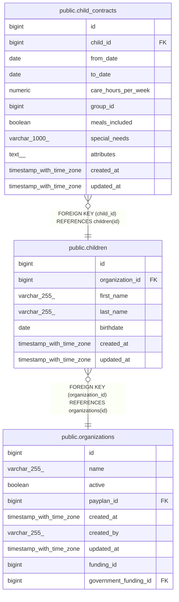

# public.child_contracts

## Description

## Columns

| Name                | Type                     | Default                                     | Nullable | Children | Parents                               | Comment |
| ------------------- | ------------------------ | ------------------------------------------- | -------- | -------- | ------------------------------------- | ------- |
| id                  | bigint                   | nextval('child_contracts_id_seq'::regclass) | false    |          |                                       |         |
| child_id            | bigint                   |                                             | false    |          | [public.children](public.children.md) |         |
| from_date           | date                     |                                             | false    |          |                                       |         |
| to_date             | date                     |                                             | true     |          |                                       |         |
| care_hours_per_week | numeric                  |                                             | true     |          |                                       |         |
| group_id            | bigint                   |                                             | true     |          |                                       |         |
| meals_included      | boolean                  |                                             | true     |          |                                       |         |
| special_needs       | varchar(1000)            |                                             | true     |          |                                       |         |
| attributes          | text[]                   |                                             | true     |          |                                       |         |
| created_at          | timestamp with time zone |                                             | true     |          |                                       |         |
| updated_at          | timestamp with time zone |                                             | true     |          |                                       |         |

## Constraints

| Name                               | Type        | Definition                                     |
| ---------------------------------- | ----------- | ---------------------------------------------- |
| child_contracts_child_id_not_null  | n           | NOT NULL child_id                              |
| child_contracts_from_date_not_null | n           | NOT NULL from_date                             |
| child_contracts_id_not_null        | n           | NOT NULL id                                    |
| fk_children_contracts              | FOREIGN KEY | FOREIGN KEY (child_id) REFERENCES children(id) |
| child_contracts_pkey               | PRIMARY KEY | PRIMARY KEY (id)                               |

## Indexes

| Name                         | Definition                                                                                 |
| ---------------------------- | ------------------------------------------------------------------------------------------ |
| child_contracts_pkey         | CREATE UNIQUE INDEX child_contracts_pkey ON public.child_contracts USING btree (id)        |
| idx_child_contracts_child_id | CREATE INDEX idx_child_contracts_child_id ON public.child_contracts USING btree (child_id) |

## Relations

---

> Generated by [tbls](https://github.com/k1LoW/tbls)
