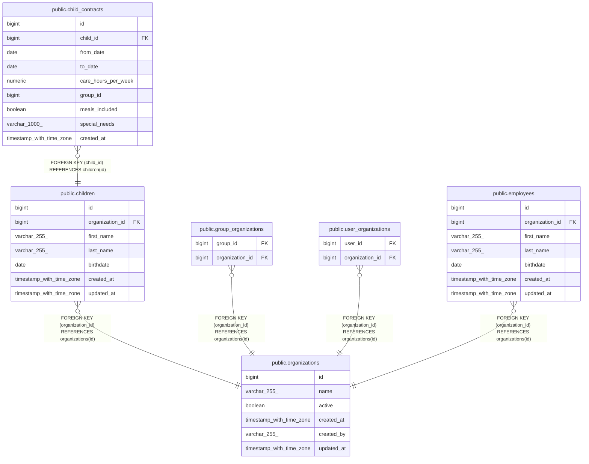

# public.children

## Description

## Columns

| Name            | Type                     | Default                              | Nullable | Children                                            | Parents                                         | Comment |
| --------------- | ------------------------ | ------------------------------------ | -------- | --------------------------------------------------- | ----------------------------------------------- | ------- |
| id              | bigint                   | nextval('children_id_seq'::regclass) | false    | [public.child_contracts](public.child_contracts.md) |                                                 |         |
| organization_id | bigint                   |                                      | false    |                                                     | [public.organizations](public.organizations.md) |         |
| first_name      | varchar(255)             |                                      | false    |                                                     |                                                 |         |
| last_name       | varchar(255)             |                                      | false    |                                                     |                                                 |         |
| birthdate       | date                     |                                      | false    |                                                     |                                                 |         |
| created_at      | timestamp with time zone |                                      | true     |                                                     |                                                 |         |
| updated_at      | timestamp with time zone |                                      | true     |                                                     |                                                 |         |

## Constraints

| Name                     | Type        | Definition                                                 |
| ------------------------ | ----------- | ---------------------------------------------------------- |
| fk_children_organization | FOREIGN KEY | FOREIGN KEY (organization_id) REFERENCES organizations(id) |
| children_pkey            | PRIMARY KEY | PRIMARY KEY (id)                                           |

## Indexes

| Name                         | Definition                                                                                 |
| ---------------------------- | ------------------------------------------------------------------------------------------ |
| children_pkey                | CREATE UNIQUE INDEX children_pkey ON public.children USING btree (id)                      |
| idx_children_organization_id | CREATE INDEX idx_children_organization_id ON public.children USING btree (organization_id) |

## Relations

---

> Generated by [tbls](https://github.com/k1LoW/tbls)
