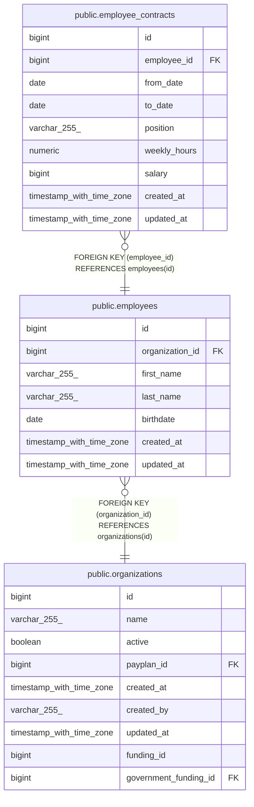

# public.employee_contracts

## Description

## Columns

| Name         | Type                     | Default                                        | Nullable | Children | Parents                                 | Comment |
| ------------ | ------------------------ | ---------------------------------------------- | -------- | -------- | --------------------------------------- | ------- |
| id           | bigint                   | nextval('employee_contracts_id_seq'::regclass) | false    |          |                                         |         |
| employee_id  | bigint                   |                                                | false    |          | [public.employees](public.employees.md) |         |
| from_date    | date                     |                                                | false    |          |                                         |         |
| to_date      | date                     |                                                | true     |          |                                         |         |
| position     | varchar(255)             |                                                | true     |          |                                         |         |
| weekly_hours | numeric                  |                                                | true     |          |                                         |         |
| salary       | bigint                   |                                                | true     |          |                                         |         |
| created_at   | timestamp with time zone |                                                | true     |          |                                         |         |
| updated_at   | timestamp with time zone |                                                | true     |          |                                         |         |

## Constraints

| Name                                    | Type        | Definition                                         |
| --------------------------------------- | ----------- | -------------------------------------------------- |
| employee_contracts_employee_id_not_null | n           | NOT NULL employee_id                               |
| employee_contracts_from_date_not_null   | n           | NOT NULL from_date                                 |
| employee_contracts_id_not_null          | n           | NOT NULL id                                        |
| fk_employees_contracts                  | FOREIGN KEY | FOREIGN KEY (employee_id) REFERENCES employees(id) |
| employee_contracts_pkey                 | PRIMARY KEY | PRIMARY KEY (id)                                   |

## Indexes

| Name                               | Definition                                                                                             |
| ---------------------------------- | ------------------------------------------------------------------------------------------------------ |
| employee_contracts_pkey            | CREATE UNIQUE INDEX employee_contracts_pkey ON public.employee_contracts USING btree (id)              |
| idx_employee_contracts_employee_id | CREATE INDEX idx_employee_contracts_employee_id ON public.employee_contracts USING btree (employee_id) |

## Relations

---

> Generated by [tbls](https://github.com/k1LoW/tbls)
