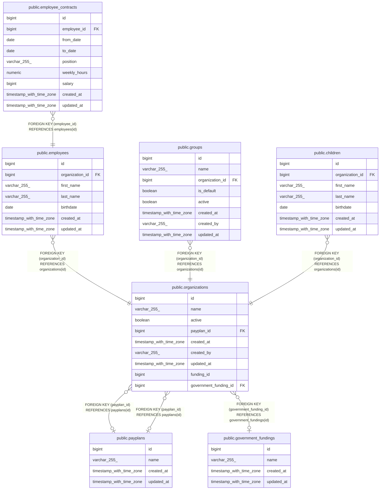

# public.employees

## Description

## Columns

| Name            | Type                     | Default                               | Nullable | Children                                                  | Parents                                         | Comment |
| --------------- | ------------------------ | ------------------------------------- | -------- | --------------------------------------------------------- | ----------------------------------------------- | ------- |
| id              | bigint                   | nextval('employees_id_seq'::regclass) | false    | [public.employee_contracts](public.employee_contracts.md) |                                                 |         |
| organization_id | bigint                   |                                       | false    |                                                           | [public.organizations](public.organizations.md) |         |
| first_name      | varchar(255)             |                                       | false    |                                                           |                                                 |         |
| last_name       | varchar(255)             |                                       | false    |                                                           |                                                 |         |
| birthdate       | date                     |                                       | false    |                                                           |                                                 |         |
| created_at      | timestamp with time zone |                                       | true     |                                                           |                                                 |         |
| updated_at      | timestamp with time zone |                                       | true     |                                                           |                                                 |         |

## Constraints

| Name                               | Type        | Definition                                                 |
| ---------------------------------- | ----------- | ---------------------------------------------------------- |
| employees_birthdate_not_null       | n           | NOT NULL birthdate                                         |
| employees_first_name_not_null      | n           | NOT NULL first_name                                        |
| employees_id_not_null              | n           | NOT NULL id                                                |
| employees_last_name_not_null       | n           | NOT NULL last_name                                         |
| employees_organization_id_not_null | n           | NOT NULL organization_id                                   |
| fk_employees_organization          | FOREIGN KEY | FOREIGN KEY (organization_id) REFERENCES organizations(id) |
| employees_pkey                     | PRIMARY KEY | PRIMARY KEY (id)                                           |

## Indexes

| Name                          | Definition                                                                                   |
| ----------------------------- | -------------------------------------------------------------------------------------------- |
| employees_pkey                | CREATE UNIQUE INDEX employees_pkey ON public.employees USING btree (id)                      |
| idx_employees_organization_id | CREATE INDEX idx_employees_organization_id ON public.employees USING btree (organization_id) |

## Relations

---

> Generated by [tbls](https://github.com/k1LoW/tbls)
