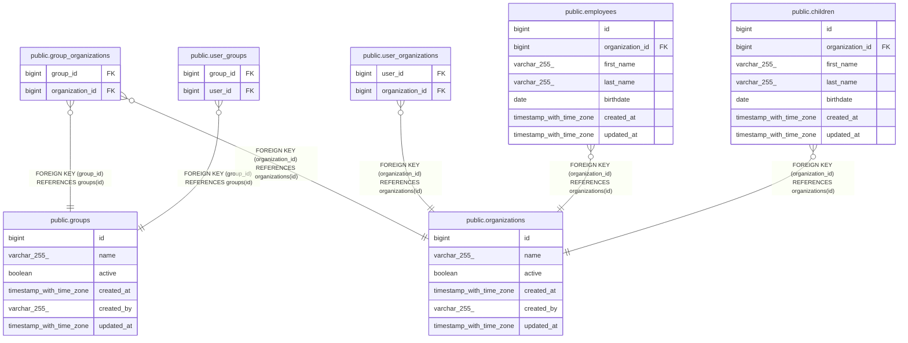

# public.group_organizations

## Description

## Columns

| Name            | Type   | Default | Nullable | Children | Parents                                         | Comment |
| --------------- | ------ | ------- | -------- | -------- | ----------------------------------------------- | ------- |
| group_id        | bigint |         | false    |          | [public.groups](public.groups.md)               |         |
| organization_id | bigint |         | false    |          | [public.organizations](public.organizations.md) |         |

## Constraints

| Name                                | Type        | Definition                                                 |
| ----------------------------------- | ----------- | ---------------------------------------------------------- |
| fk_group_organizations_organization | FOREIGN KEY | FOREIGN KEY (organization_id) REFERENCES organizations(id) |
| fk_group_organizations_group        | FOREIGN KEY | FOREIGN KEY (group_id) REFERENCES groups(id)               |
| group_organizations_pkey            | PRIMARY KEY | PRIMARY KEY (group_id, organization_id)                    |

## Indexes

| Name                     | Definition                                                                                                         |
| ------------------------ | ------------------------------------------------------------------------------------------------------------------ |
| group_organizations_pkey | CREATE UNIQUE INDEX group_organizations_pkey ON public.group_organizations USING btree (group_id, organization_id) |

## Relations

---

> Generated by [tbls](https://github.com/k1LoW/tbls)
