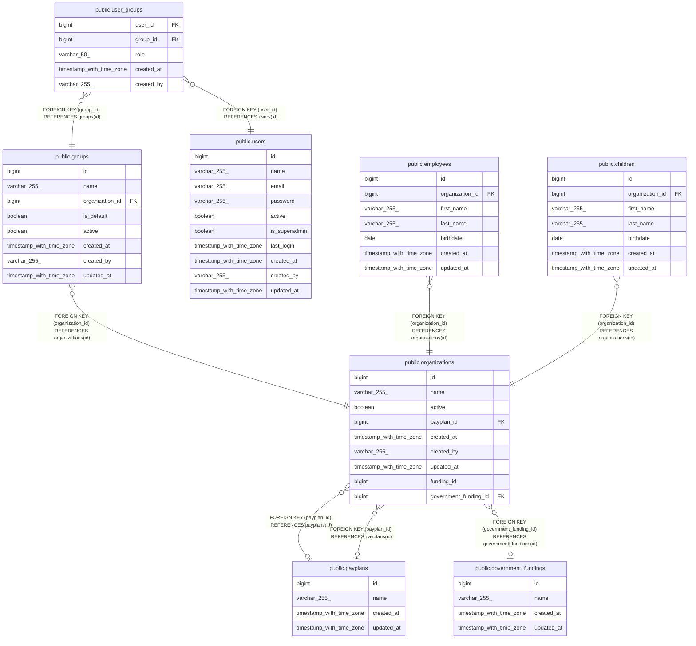

# public.groups

## Description

## Columns

| Name            | Type                     | Default                            | Nullable | Children                                    | Parents                                         | Comment |
| --------------- | ------------------------ | ---------------------------------- | -------- | ------------------------------------------- | ----------------------------------------------- | ------- |
| id              | bigint                   | nextval('groups_id_seq'::regclass) | false    | [public.user_groups](public.user_groups.md) |                                                 |         |
| name            | varchar(255)             |                                    | false    |                                             |                                                 |         |
| organization_id | bigint                   |                                    | false    |                                             | [public.organizations](public.organizations.md) |         |
| is_default      | boolean                  | false                              | true     |                                             |                                                 |         |
| active          | boolean                  | true                               | true     |                                             |                                                 |         |
| created_at      | timestamp with time zone |                                    | true     |                                             |                                                 |         |
| created_by      | varchar(255)             |                                    | true     |                                             |                                                 |         |
| updated_at      | timestamp with time zone |                                    | true     |                                             |                                                 |         |

## Constraints

| Name                            | Type        | Definition                                                 |
| ------------------------------- | ----------- | ---------------------------------------------------------- |
| groups_id_not_null              | n           | NOT NULL id                                                |
| groups_name_not_null            | n           | NOT NULL name                                              |
| groups_organization_id_not_null | n           | NOT NULL organization_id                                   |
| fk_organizations_groups         | FOREIGN KEY | FOREIGN KEY (organization_id) REFERENCES organizations(id) |
| groups_pkey                     | PRIMARY KEY | PRIMARY KEY (id)                                           |

## Indexes

| Name        | Definition                                                        |
| ----------- | ----------------------------------------------------------------- |
| groups_pkey | CREATE UNIQUE INDEX groups_pkey ON public.groups USING btree (id) |

## Relations

---

> Generated by [tbls](https://github.com/k1LoW/tbls)
