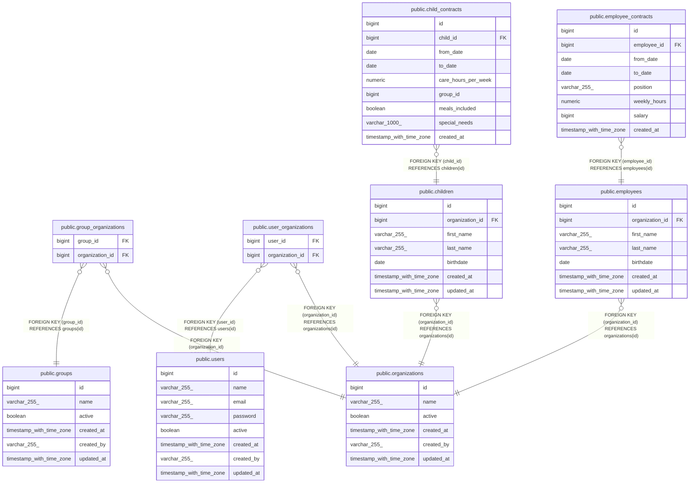

# public.organizations

## Description

## Columns

| Name       | Type                     | Default                                   | Nullable | Children                                                                                                                                                                                            | Parents | Comment |
| ---------- | ------------------------ | ----------------------------------------- | -------- | --------------------------------------------------------------------------------------------------------------------------------------------------------------------------------------------------- | ------- | ------- |
| id         | bigint                   | nextval('organizations_id_seq'::regclass) | false    | [public.group_organizations](public.group_organizations.md) [public.user_organizations](public.user_organizations.md) [public.employees](public.employees.md) [public.children](public.children.md) |         |         |
| name       | varchar(255)             |                                           | false    |                                                                                                                                                                                                     |         |         |
| active     | boolean                  | true                                      | true     |                                                                                                                                                                                                     |         |         |
| created_at | timestamp with time zone |                                           | true     |                                                                                                                                                                                                     |         |         |
| created_by | varchar(255)             |                                           | true     |                                                                                                                                                                                                     |         |         |
| updated_at | timestamp with time zone |                                           | true     |                                                                                                                                                                                                     |         |         |

## Constraints

| Name               | Type        | Definition       |
| ------------------ | ----------- | ---------------- |
| organizations_pkey | PRIMARY KEY | PRIMARY KEY (id) |

## Indexes

| Name               | Definition                                                                      |
| ------------------ | ------------------------------------------------------------------------------- |
| organizations_pkey | CREATE UNIQUE INDEX organizations_pkey ON public.organizations USING btree (id) |

## Relations

---

> Generated by [tbls](https://github.com/k1LoW/tbls)
