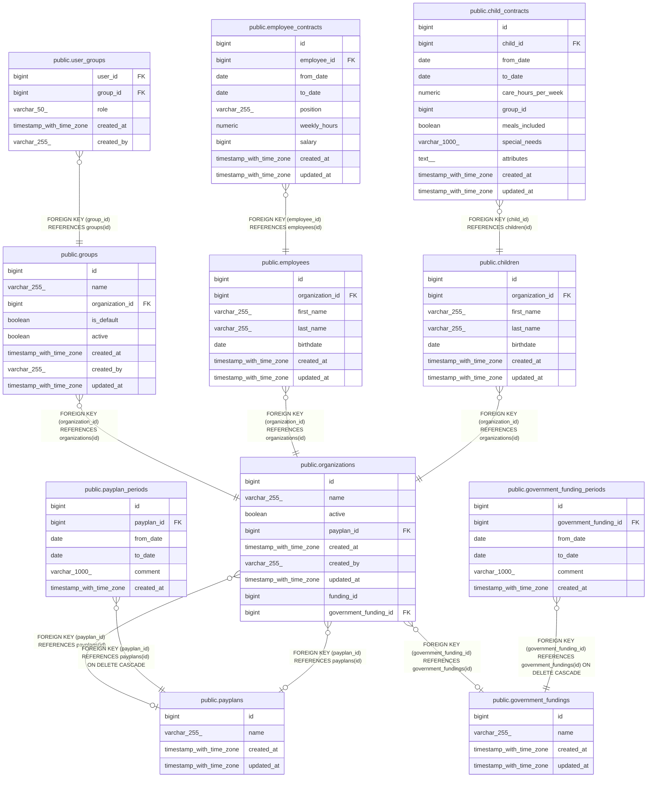

# public.organizations

## Description

## Columns

| Name                  | Type                     | Default                                   | Nullable | Children                                                                                                        | Parents                                                     | Comment |
| --------------------- | ------------------------ | ----------------------------------------- | -------- | --------------------------------------------------------------------------------------------------------------- | ----------------------------------------------------------- | ------- |
| id                    | bigint                   | nextval('organizations_id_seq'::regclass) | false    | [public.groups](public.groups.md) [public.employees](public.employees.md) [public.children](public.children.md) |                                                             |         |
| name                  | varchar(255)             |                                           | false    |                                                                                                                 |                                                             |         |
| active                | boolean                  | true                                      | true     |                                                                                                                 |                                                             |         |
| payplan_id            | bigint                   |                                           | true     |                                                                                                                 | [public.payplans](public.payplans.md)                       |         |
| created_at            | timestamp with time zone |                                           | true     |                                                                                                                 |                                                             |         |
| created_by            | varchar(255)             |                                           | true     |                                                                                                                 |                                                             |         |
| updated_at            | timestamp with time zone |                                           | true     |                                                                                                                 |                                                             |         |
| funding_id            | bigint                   |                                           | true     |                                                                                                                 |                                                             |         |
| government_funding_id | bigint                   |                                           | true     |                                                                                                                 | [public.government_fundings](public.government_fundings.md) |         |

## Constraints

| Name                                | Type        | Definition                                                             |
| ----------------------------------- | ----------- | ---------------------------------------------------------------------- |
| organizations_id_not_null           | n           | NOT NULL id                                                            |
| organizations_name_not_null         | n           | NOT NULL name                                                          |
| fk_organizations_funding            | FOREIGN KEY | FOREIGN KEY (payplan_id) REFERENCES payplans(id)                       |
| fk_organizations_payplan            | FOREIGN KEY | FOREIGN KEY (payplan_id) REFERENCES payplans(id)                       |
| organizations_pkey                  | PRIMARY KEY | PRIMARY KEY (id)                                                       |
| fk_organizations_government_funding | FOREIGN KEY | FOREIGN KEY (government_funding_id) REFERENCES government_fundings(id) |

## Indexes

| Name               | Definition                                                                      |
| ------------------ | ------------------------------------------------------------------------------- |
| organizations_pkey | CREATE UNIQUE INDEX organizations_pkey ON public.organizations USING btree (id) |

## Relations

---

> Generated by [tbls](https://github.com/k1LoW/tbls)
