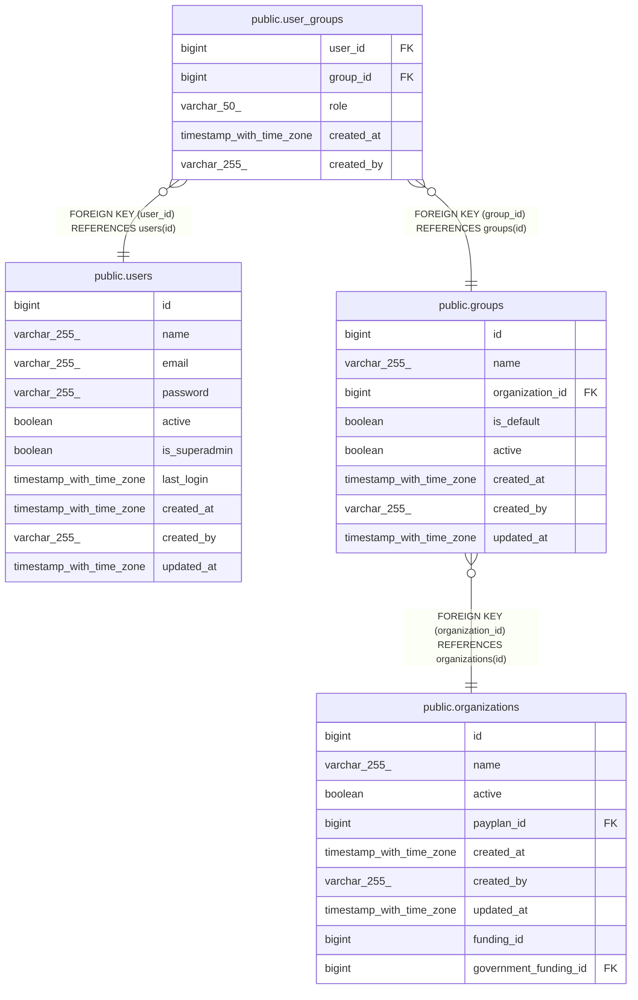

# public.user_groups

## Description

## Columns

| Name       | Type                     | Default                     | Nullable | Children | Parents                           | Comment |
| ---------- | ------------------------ | --------------------------- | -------- | -------- | --------------------------------- | ------- |
| user_id    | bigint                   |                             | false    |          | [public.users](public.users.md)   |         |
| group_id   | bigint                   |                             | false    |          | [public.groups](public.groups.md) |         |
| role       | varchar(50)              | 'member'::character varying | false    |          |                                   |         |
| created_at | timestamp with time zone |                             | true     |          |                                   |         |
| created_by | varchar(255)             |                             | true     |          |                                   |         |

## Constraints

| Name                          | Type        | Definition                                   |
| ----------------------------- | ----------- | -------------------------------------------- |
| user_groups_group_id_not_null | n           | NOT NULL group_id                            |
| user_groups_role_not_null     | n           | NOT NULL role                                |
| user_groups_user_id_not_null  | n           | NOT NULL user_id                             |
| fk_users_user_groups          | FOREIGN KEY | FOREIGN KEY (user_id) REFERENCES users(id)   |
| fk_user_groups_group          | FOREIGN KEY | FOREIGN KEY (group_id) REFERENCES groups(id) |
| user_groups_pkey              | PRIMARY KEY | PRIMARY KEY (user_id, group_id)              |

## Indexes

| Name             | Definition                                                                                 |
| ---------------- | ------------------------------------------------------------------------------------------ |
| user_groups_pkey | CREATE UNIQUE INDEX user_groups_pkey ON public.user_groups USING btree (user_id, group_id) |

## Relations

---

> Generated by [tbls](https://github.com/k1LoW/tbls)
