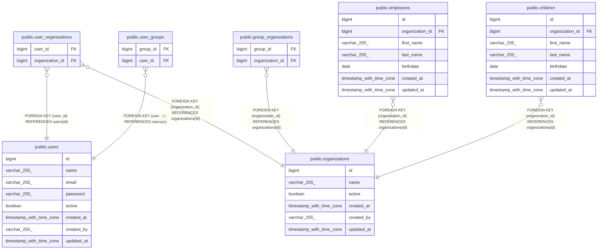

# public.user_organizations

## Description

## Columns

| Name            | Type   | Default | Nullable | Children | Parents                                         | Comment |
| --------------- | ------ | ------- | -------- | -------- | ----------------------------------------------- | ------- |
| user_id         | bigint |         | false    |          | [public.users](public.users.md)                 |         |
| organization_id | bigint |         | false    |          | [public.organizations](public.organizations.md) |         |

## Constraints

| Name                                        | Type        | Definition                                                 |
| ------------------------------------------- | ----------- | ---------------------------------------------------------- |
| user_organizations_organization_id_not_null | n           | NOT NULL organization_id                                   |
| user_organizations_user_id_not_null         | n           | NOT NULL user_id                                           |
| fk_user_organizations_organization          | FOREIGN KEY | FOREIGN KEY (organization_id) REFERENCES organizations(id) |
| fk_user_organizations_user                  | FOREIGN KEY | FOREIGN KEY (user_id) REFERENCES users(id)                 |
| user_organizations_pkey                     | PRIMARY KEY | PRIMARY KEY (user_id, organization_id)                     |

## Indexes

| Name                    | Definition                                                                                                      |
| ----------------------- | --------------------------------------------------------------------------------------------------------------- |
| user_organizations_pkey | CREATE UNIQUE INDEX user_organizations_pkey ON public.user_organizations USING btree (user_id, organization_id) |

## Relations

---

> Generated by [tbls](https://github.com/k1LoW/tbls)
