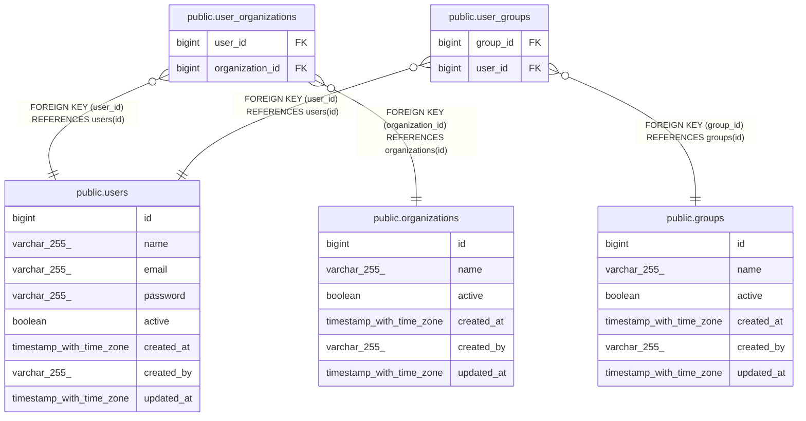

# public.users

## Description

## Columns

| Name       | Type                     | Default                           | Nullable | Children                                                                                              | Parents | Comment |
| ---------- | ------------------------ | --------------------------------- | -------- | ----------------------------------------------------------------------------------------------------- | ------- | ------- |
| id         | bigint                   | nextval('users_id_seq'::regclass) | false    | [public.user_organizations](public.user_organizations.md) [public.user_groups](public.user_groups.md) |         |         |
| name       | varchar(255)             |                                   | false    |                                                                                                       |         |         |
| email      | varchar(255)             |                                   | false    |                                                                                                       |         |         |
| password   | varchar(255)             |                                   | false    |                                                                                                       |         |         |
| active     | boolean                  | true                              | true     |                                                                                                       |         |         |
| created_at | timestamp with time zone |                                   | true     |                                                                                                       |         |         |
| created_by | varchar(255)             |                                   | true     |                                                                                                       |         |         |
| updated_at | timestamp with time zone |                                   | true     |                                                                                                       |         |         |

## Constraints

| Name       | Type        | Definition       |
| ---------- | ----------- | ---------------- |
| users_pkey | PRIMARY KEY | PRIMARY KEY (id) |

## Indexes

| Name            | Definition                                                              |
| --------------- | ----------------------------------------------------------------------- |
| users_pkey      | CREATE UNIQUE INDEX users_pkey ON public.users USING btree (id)         |
| idx_users_email | CREATE UNIQUE INDEX idx_users_email ON public.users USING btree (email) |

## Relations

---

> Generated by [tbls](https://github.com/k1LoW/tbls)
