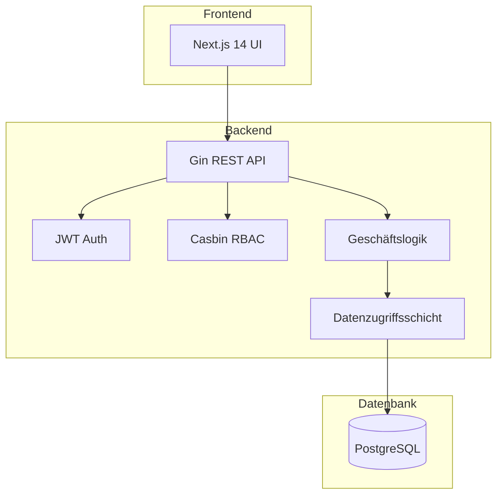

KitaManager Go folgt einem Clean-Architecture-Muster mit klarer Trennung der Verantwortlichkeiten.

## Systemübersicht



## Projektstruktur

```
kitamanager-go/
├── cmd/api/                 # Anwendungs-Einstiegspunkt
├── internal/
│   ├── handlers/           # HTTP-Request-Handler
│   ├── models/             # Domänenmodelle
│   ├── store/              # Datenzugriffsschicht
│   ├── service/            # Geschäftslogikschicht
│   ├── middleware/         # Auth, CORS, Logging
│   ├── rbac/               # Rollenbasierte Zugriffskontrolle
│   ├── database/           # Datenbankverbindung
│   ├── config/             # Konfigurationsverwaltung
│   └── seed/               # Testdaten-Initialisierung
├── frontend/               # Next.js React-Anwendung
├── docs/                   # Dokumentation
└── configs/                # Konfigurationsdateien
```

## Technologie-Stack

### Backend

| Technologie | Zweck |
|-------------|-------|
| Go 1.25 | Primäre Sprache |
| Gin | HTTP-Web-Framework |
| GORM | ORM für Datenbankzugriff |
| Casbin | Autorisierungs-Engine |
| JWT | Authentifizierungs-Token |
| Swagger | API-Dokumentation |

### Frontend

| Technologie | Zweck |
|-------------|-------|
| Next.js 14 | React-Framework |
| TypeScript | Typsicheres JavaScript |
| Tailwind CSS | Styling |
| Radix UI | Komponentenbibliothek |
| TanStack Query | Datenabruf |
| Zustand | Zustandsverwaltung |

### Infrastruktur

| Technologie | Zweck |
|-------------|-------|
| PostgreSQL | Primäre Datenbank |
| Docker | Containerisierung |
| GitHub Actions | CI/CD |

## RBAC-Architektur

Die Anwendung verwendet ein hybrides RBAC-System:

1. **Datenbank** speichert Benutzer-Rolle-Organisation-Zuweisungen (auditierbar, abfragbar)
2. **Casbin** speichert Rolle-Berechtigung-Zuordnungen (optimierte Richtlinienauswertung)

### Rollenhierarchie

| Rolle | Geltungsbereich | Berechtigungen |
|-------|-----------------|----------------|
| Superadmin | Global | Vollständiger Systemzugriff |
| Admin | Organisation | Vollständiger Org-Zugriff |
| Manager | Organisation | Operativer Zugriff |
| Mitglied | Organisation | Nur-Lese-Zugriff |

### Organisationsbezogene Ressourcen

Ressourcen, die zu einer Organisation gehören, verwenden URL-Muster:

```
/api/v1/organizations/{orgId}/employees
/api/v1/organizations/{orgId}/children
/api/v1/organizations/{orgId}/sections
```

## Datenfluss

1. **Anfrage** erreicht den Gin-Router
2. **Middleware** behandelt Authentifizierung und Autorisierung
3. **Handler** validiert Eingaben und ruft die Service-Schicht auf
4. **Service** implementiert Geschäftslogik
5. **Store** führt Datenbankoperationen aus
6. **Antwort** wird serialisiert und zurückgegeben
