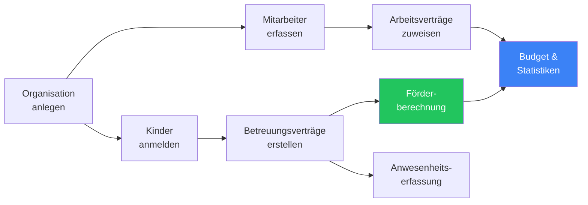
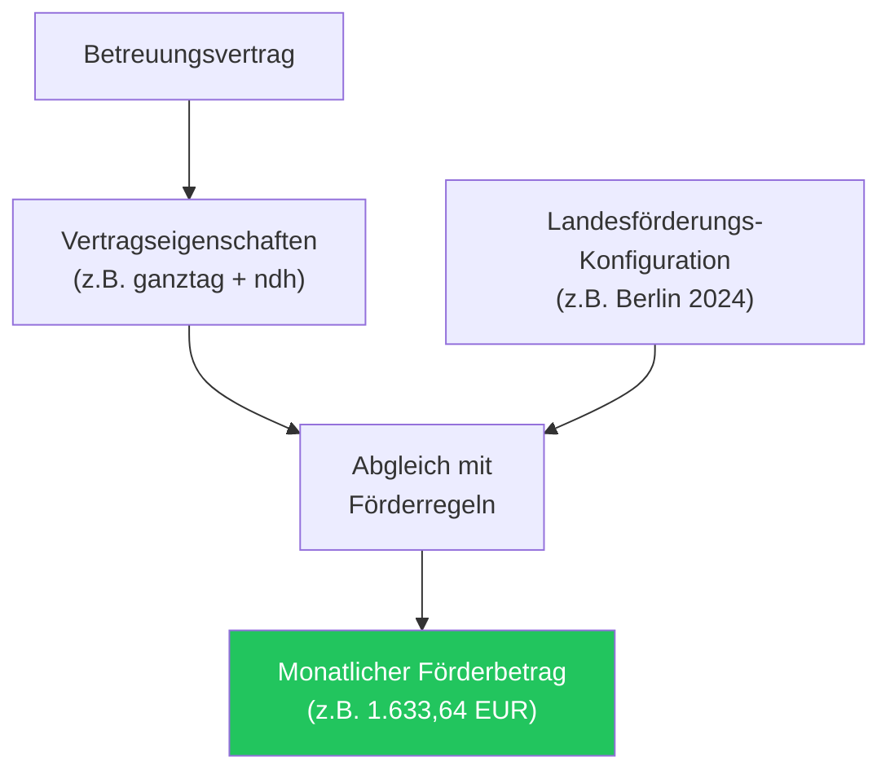

KitaManager ist eine webbasierte Verwaltungsplattform für Kindertagesstätten (Kitas) in Deutschland. Sie unterstützt Einrichtungsleitungen bei den täglichen Verwaltungsaufgaben — von Mitarbeiterdaten und Kinderanmeldungen über die automatische Berechnung der Landesförderung und Anwesenheitserfassung bis hin zu Budgetverwaltung und Berichtswesen.

## So funktioniert es

Ein typischer Arbeitsablauf in KitaManager sieht so aus:

1. **Organisation einrichten** — Ihre Kita mit Name, Bundesland und Bereichen registrieren.
2. **Personal erfassen** — Mitarbeiterdaten eingeben, Positionen zuweisen und Arbeitsverträge erstellen.
3. **Kinder anmelden** — Kinder mit persönlichen Daten registrieren, Bereichen zuordnen und Betreuungsverträge anlegen.
4. **Förderung wird automatisch berechnet** — basierend auf den Vertragseigenschaften jedes Kindes und den Förderregeln des jeweiligen Bundeslandes.
5. **Anwesenheit erfassen** — die tägliche Anwesenheit jedes Kindes dokumentieren.
6. **Finanzen und Statistiken überwachen** — Budgets, Statistiken und Berichte zur Betriebssteuerung nutzen.

---

## Organisationsverwaltung

Jede Kita wird im System als **Organisation** abgebildet. Wenn Sie mehrere Einrichtungen betreiben, erhält jede eine eigene Organisation mit vollständig getrennten Daten.

| Funktion | Beschreibung |
|---|---|
| Mehrere Einrichtungen | Betreiben Sie mehrere Kitas aus einer einzigen KitaManager-Instanz |
| Datentrennung | Kinder, Mitarbeiter, Verträge und Budgets sind ihrer Organisation zugeordnet |
| Bundesland-Konfiguration | Jeder Organisation wird ein Bundesland zugewiesen, das die geltenden Förderregeln bestimmt |
| Bereiche | Organisieren Sie Kinder und Personal in Gruppen innerhalb der Einrichtung |

Administratoren sehen alle ihre Organisationen auf einer Übersichtsseite und können über die Seitenleiste zwischen ihnen wechseln.

---

## Bereiche

Bereiche repräsentieren Gruppen innerhalb einer Kita — zum Beispiel „Schmetterlinge" oder „Sonnenkäfer". Sie ermöglichen die Gliederung Ihrer Einrichtung in überschaubare Einheiten.

| Funktion | Beschreibung |
|---|---|
| Benannte Bereiche anlegen | Definieren Sie Gruppen, die die Struktur Ihrer Einrichtung widerspiegeln |
| Kinder zuordnen | Weisen Sie jedes Kind einem Bereich für die tägliche Gruppierung zu |
| Mitarbeiter zuordnen | Verknüpfen Sie Mitarbeiter mit den Bereichen, in denen sie arbeiten |
| Nach Bereich filtern | Statistiken und Berichte können nach Bereich gefiltert werden |

---

## Personalverwaltung

Das Personalmodul ermöglicht die Pflege einer vollständigen Mitarbeiterdatenbank für jede Kita.

### Was Sie pro Mitarbeiter erfassen können

| Feld | Beispiel |
|---|---|
| Name, Geschlecht, Geburtsdatum | Anna Müller, Weiblich, 06.05.2000 |
| Position | Erzieher, Kinderpfleger, Gruppenleitung |
| Entgeltgruppe und Stufe | S8a / Stufe 3 |
| Wochenstunden | 39 Stunden |
| Vertragszeitraum | 01.01.2024 — 31.12.2025 |

### Arbeitsverträge

Jeder Mitarbeiter kann im Laufe der Zeit einen oder mehrere **Arbeitsverträge** haben. Verträge definieren Position, Entgeltgruppe, Stufe, Wochenstunden und Gültigkeitszeitraum. Das System stellt sicher, dass sich Verträge für denselben Mitarbeiter nicht überschneiden.

### Stufenaufstiege

KitaManager verfolgt, wann Mitarbeiter basierend auf ihrem Vertragsbeginn und ihrer aktuellen Stufe für den nächsten Stufenaufstieg berechtigt sind. Benachrichtigungen über anstehende Stufenaufstiege erscheinen auf dem Dashboard, damit Administratoren rechtzeitig auf bevorstehende Gehaltsänderungen reagieren können.

### Import und Export

- **Import** von Mitarbeiterdaten aus YAML-Dateien für die Massenerfassung.
- **Export** von Mitarbeiterlisten nach Excel oder YAML für Berichtswesen und Archivierung.

---

## Kinderverwaltung

Das Kindermodul verfolgt jedes in Ihrer Kita angemeldete Kind samt Betreuungsverträgen und Förderung.

### Was Sie pro Kind erfassen können

| Feld | Beispiel |
|---|---|
| Name, Geschlecht, Geburtsdatum | Laura Lange, Weiblich, 27.03.2023 |
| Gutscheinnummer | Eindeutige Kennung der Kommune |
| Bereich | Schmetterlinge |
| Betreuungseigenschaften | ganztag, ndh, integration_a |
| Berechnete monatliche Förderung | 1.633,64 EUR |

### Betreuungsverträge

Jedes Kind hat einen oder mehrere **Betreuungsverträge**, die den Anmeldezeitraum und die Art der Betreuung festlegen. Vertragseigenschaften beschreiben die Betreuungsvereinbarung:

| Eigenschaft | Bedeutung |
|---|---|
| `halbtag` | Halbtagsbetreuung |
| `ganztag` | Ganztagsbetreuung |
| `teilzeit` | Teilzeitbetreuung |
| `ndh` | Nichtdeutsche Herkunftssprache |
| `mss` | MSS-Zuschlag |
| `integration_a` | Integrationsstufe A |
| `integration_b` | Integrationsstufe B |

Diese Eigenschaften bestimmen direkt, wie viel Landesförderung die Kita für jedes Kind erhält (siehe [Landesförderung](#landesförderung) unten).

### Import und Export

- **Import** von Kinderdaten aus YAML-Dateien für die Massenanmeldung.
- **Export** von Kinderlisten nach Excel oder YAML.

---

## Anwesenheitserfassung

KitaManager bietet eine tägliche Anwesenheitserfassung für jedes Kind in Ihrer Einrichtung.

| Funktion | Beschreibung |
|---|---|
| Wochenübersicht | Anwesenheit aller Kinder in einer Wochenansicht einsehen und bearbeiten |
| Anwesenheitsstatus | Kinder für jeden Tag als anwesend oder abwesend markieren |
| Verlauf pro Kind | Den vollständigen Anwesenheitsverlauf eines einzelnen Kindes einsehen |
| Organisationsweite Übersicht | Anwesenheitssummen der gesamten Einrichtung anzeigen |
| Zugriff für Personal | Benutzer mit der Rolle **Personal** können die Anwesenheit direkt erfassen und aktualisieren |

Anwesenheitsdaten sind der Organisation zugeordnet und können nach Bereich ausgewertet werden.

---

## Landesförderung

Eine der Kernfunktionen von KitaManager ist die automatische Berechnung der staatlichen Kita-Förderung basierend auf den Regeln des jeweiligen Bundeslandes.

### So funktioniert die Förderberechnung

1. Jeder Betreuungsvertrag hat **Eigenschaften**, die die Betreuungsart beschreiben.
2. Das System sucht den passenden **Fördereintrag** aus den konfigurierten Landesförderungsregeln.
3. Der resultierende **Monatsbetrag** wird direkt in der Kinderliste angezeigt.

### Förderungs-Konfiguration

Die Förderung wird pro Bundesland und Zeitraum konfiguriert. Jeder Fördereintrag ordnet eine Kombination von Eigenschaften einem monatlichen Betrag in Euro zu:

| Eigenschaften | Monatsbetrag |
|---|---|
| halbtag | 1.215,45 EUR |
| halbtag + ndh | 1.318,11 EUR |
| ganztag | 1.909,61 EUR |
| ganztag + integration_a | 3.566,41 EUR |
| teilzeit + ndh | 1.633,64 EUR |

Förderzeiträume können aktualisiert werden, wenn sich die Landessätze ändern, ohne historische Daten zu beeinflussen.

### ISBJ-Abrechnungsvergleich

KitaManager unterstützt den Upload von Förderabrechnungen im **ISBJ-Format**. Nach dem Upload vergleicht das System die abgerechneten Beträge mit den eigenen berechneten Förderbeträgen, um Abweichungen zu erkennen — so können Sie Unterzahlungen oder Fehler frühzeitig aufdecken.

---

## Budgetverwaltung

Das Budgetmodul ermöglicht die Planung und Nachverfolgung von Einnahmen und Ausgaben Ihrer Kita.

| Funktion | Beschreibung |
|---|---|
| Budgetposten | Kategorien für Einnahmen und Ausgaben anlegen (z.B. „Personalkosten", „Sachmittel", „Elternbeiträge") |
| Zeitgebundene Einträge | Einträge mit Beträgen und Gültigkeitszeiträumen zu jedem Budgetposten hinzufügen |
| Ausgabenverfolgung | Tatsächliche Ausgaben im Vergleich zu geplanten Budgets überwachen |
| Organisationsbezogen | Jede Organisation verwaltet ein eigenes unabhängiges Budget |

---

## Statistiken und Berichte

KitaManager bietet sieben Arten von Statistiken zur Unterstützung operativer Entscheidungen. Alle Statistikseiten bieten druckfreundliche Ansichten und können nach Datumsbereich und Bereich gefiltert werden.

| Statistik | Inhalt |
|---|---|
| **Personalstunden** | Gesamte Wochenstunden über alle Arbeitsverträge |
| **Finanzen** | Einnahmen- und Kostenübersichten basierend auf Förderungs- und Vergütungsplandaten |
| **Auslastung** | Anzahl der angemeldeten Kinder im Verhältnis zur Kapazität |
| **Personaldetails** | Aufschlüsselung pro Mitarbeiter nach Stunden, Entgeltgruppe und Stufe |
| **Altersverteilung** | Kinder gruppiert nach Altersgruppen |
| **Vertragseigenschaften-Verteilung** | Aufschlüsselung der Betreuungsarten und Zuschläge über alle Betreuungsverträge |
| **Förderungsübersicht** | Zusammenfassung der berechneten Förderbeträge nach Eigenschaftskombination |

---

## Vergütungspläne

Vergütungspläne definieren die in Ihrer Einrichtung verwendeten Entgeltgruppen und Stufen — in der Regel basierend auf dem **TVöD-SuE**-Tarifvertrag für den deutschen öffentlichen Kita-Bereich.

| Funktion | Beschreibung |
|---|---|
| Entgeltgruppen und Stufen | Definieren Sie Gehaltstabellen mit Gruppen (z.B. S3, S8a, S8b) und Stufen (1–6) |
| Monatsbeträge | Legen Sie das monatliche Bruttogehalt für jede Gruppen-/Stufenkombination fest |
| Mehrere Zeiträume | Erstellen Sie separate Vergütungsplanzeiträume bei Tarifänderungen (z.B. jährliche Anpassungen) |
| Arbeitgeberanteile | Konfigurieren Sie die Prozentsätze für Arbeitgeber-Sozialabgaben |
| Import/Export | Import und Export von Vergütungsplandefinitionen per YAML |

Wenn Sie einem Arbeitsvertrag eine Entgeltgruppe und Stufe zuweisen, verwendet das System den aktiven Vergütungsplan zur Kostenberechnung und Verfolgung des Stufenaufstiegs.

---

## Benutzerrollen und Zugriffskontrolle

KitaManager verwendet ein rollenbasiertes Zugriffskontrollsystem (RBAC), das sicherstellt, dass Benutzer nur auf die für ihre Rolle und Organisation relevanten Daten zugreifen können.

### Rollenübersicht

| Rolle | Geltungsbereich | Beschreibung |
|---|---|---|
| **Superadmin** | Alle Organisationen | Vollständiger Systemzugriff. Kann Organisationen erstellen und löschen sowie alle Ressourcen global verwalten. |
| **Admin** | Zugewiesene Org(s) | Volle Kontrolle innerhalb zugewiesener Organisationen. Kann Mitarbeiter, Kinder, Förderung, Benutzer und Bereiche verwalten. |
| **Manager** | Zugewiesene Org(s) | Operativer Zugriff. Kann Mitarbeiter, Kinder und Verträge verwalten. Lesezugriff auf Benutzer, Gruppen und Bereiche. |
| **Mitglied** | Zugewiesene Org(s) | Lesezugriff auf Mitarbeiter, Kinder, Verträge und Bereiche. |
| **Personal** | Zugewiesene Org(s) | Lesezugriff auf Kinder, Verträge und Bereiche. Vollständiger CRUD-Zugriff auf Anwesenheit. Konzipiert für Erzieher und Assistenzkräfte. |

### Berechtigungsmatrix

| Ressource | Superadmin | Admin | Manager | Mitglied | Personal |
|---|---|---|---|---|---|
| Organisationen | Vollständiger CRUD | Lesen + Bearbeiten | Lesen | Lesen | Lesen |
| Mitarbeiter | Vollständiger CRUD | Vollständiger CRUD | Vollständiger CRUD | Lesen | - |
| Arbeitsverträge | Vollständiger CRUD | Vollständiger CRUD | Vollständiger CRUD | Lesen | - |
| Kinder | Vollständiger CRUD | Vollständiger CRUD | Vollständiger CRUD | Lesen | Lesen |
| Betreuungsverträge | Vollständiger CRUD | Vollständiger CRUD | Vollständiger CRUD | Lesen | Lesen |
| Anwesenheit | Vollständiger CRUD | Vollständiger CRUD | Vollständiger CRUD | - | Vollständiger CRUD |
| Bereiche | Vollständiger CRUD | Vollständiger CRUD | Lesen | Lesen | Lesen |
| Benutzer | Vollständiger CRUD | Vollständiger CRUD | Lesen | - | - |
| Gruppen | Vollständiger CRUD | Vollständiger CRUD | Lesen | - | - |
| Vergütungspläne | Vollständiger CRUD | Vollständiger CRUD | Lesen | Lesen | - |
| Förderungen | Vollständiger CRUD | Vollständiger CRUD | - | - | - |

### Audit-Protokollierung

Alle Datenänderungen werden in einem Audit-Log erfasst. Jede Erstellungs-, Aktualisierungs- und Löschaktion wird mit dem handelnden Benutzer, Zeitstempel und der betroffenen Ressource protokolliert — für Nachvollziehbarkeit und Compliance.

---

## Dashboard

Nach der Anmeldung sehen Benutzer ein Dashboard, das einen schnellen Überblick über ihre Kita bietet.

| Funktion | Beschreibung |
|---|---|
| Organisationsübersicht | Gesamtzahlen der Organisationen, Mitarbeiter, Kinder und Benutzer |
| Stufenaufstiegs-Benachrichtigungen | Hinweise, wenn Mitarbeiter für ihren nächsten Stufenaufstieg berechtigt sind |
| Bevorstehende Kinder | Kinder mit Betreuungsbeginn in naher Zukunft |
| Bereichs-Altershinweise | Warnungen, wenn Kinder in einem Bereich Altersgrenzen erreichen |

Die Seitenleiste bietet direkten Zugriff auf alle Verwaltungsbereiche: Organisationen, Mitarbeiter, Kinder, Anwesenheit, Landesförderung, Statistiken, Budgets, Vergütungspläne, Bereiche und Benutzerverwaltung.

---

## Import und Export

KitaManager unterstützt Massendatenoperationen durch YAML-Import und Excel-/YAML-Export.

| Ressource | YAML-Import | Excel-Export | YAML-Export |
|---|---|---|---|
| Kinder | Ja | Ja | Ja |
| Mitarbeiter | Ja | Ja | Ja |
| Vergütungspläne | Ja | - | Ja |
| Landesförderungssätze | Ja | - | - |

Importe validieren die Daten vor dem Speichern, und Exporte erzeugen Dateien, die für die Offline-Analyse oder Archivierung bereitstehen.

---

## Mobilfreundliches Design

KitaManager wurde mit einem responsiven Layout entwickelt, das auf allen Geräten funktioniert. Die Benutzeroberfläche passt sich an Smartphones, Tablets und Desktops an — mit berührungsfreundlichen Steuerelementen und angemessen dimensionierten Klickflächen.

| Ansicht | Min. Breite | Optimiert für |
|---|---|---|
| Smartphone | 375px | Einspaltiges Layout, wesentliche Daten sichtbar |
| Tablet | 768px | Zweispaltiges Layout, vollständige Tabellenansichten |
| Desktop | 1024px+ | Mehrspaltiges Layout mit allen Details |

Erzieher und Mitarbeiter können KitaManager auf Tablets während ihres Arbeitstags nutzen — zum Beispiel, um die Anwesenheit direkt aus dem Gruppenraum zu erfassen.

---

## Mehrsprachigkeit

Die Benutzeroberfläche ist in **Englisch** und **Deutsch** verfügbar und kann jederzeit über die Navigationsleiste umgeschaltet werden. Alle Beschriftungen, Meldungen und Validierungsfehler sind übersetzt.

KitaManager unterstützt außerdem einen **Dark Mode**, der in der Benutzeroberfläche umgeschaltet werden kann — für komfortables Arbeiten bei allen Lichtverhältnissen.
