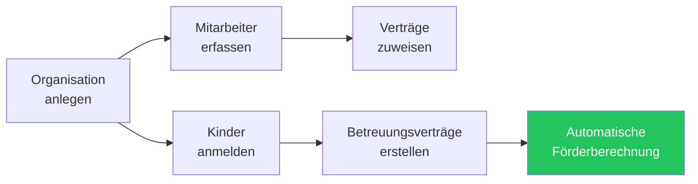
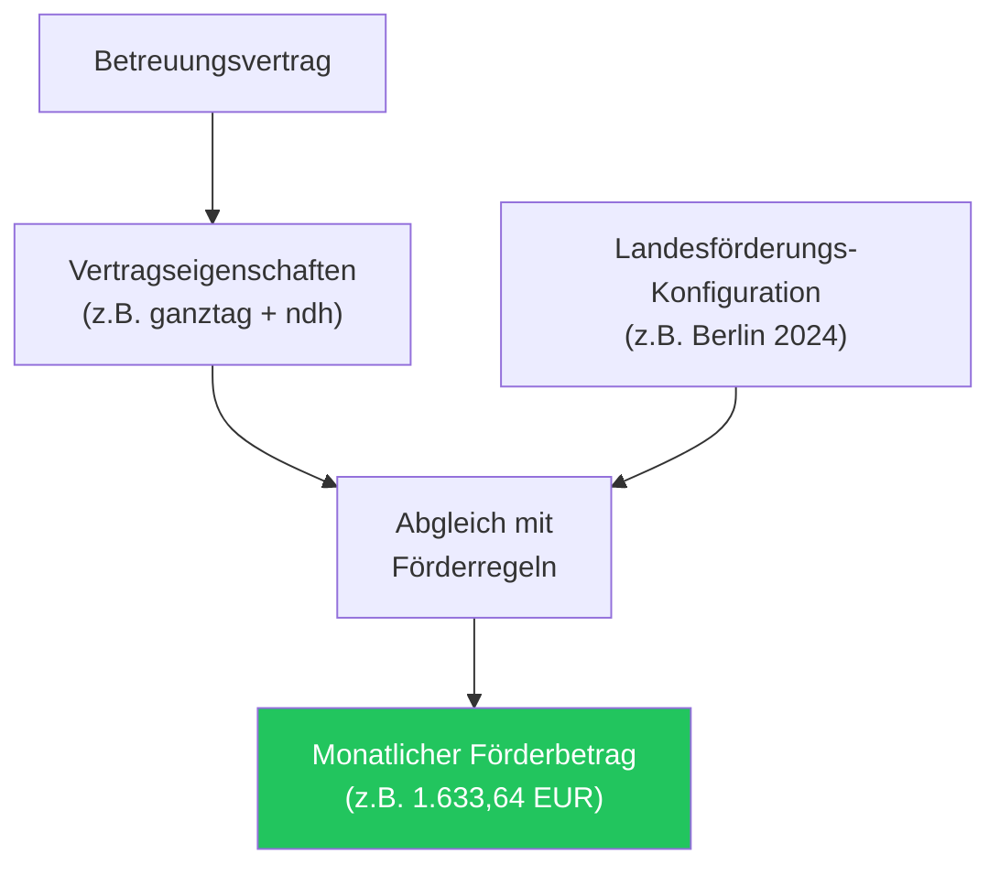

KitaManager Go ist eine webbasierte Verwaltungsplattform für Kindertagesstätten (Kitas) in Deutschland. Sie unterstützt Einrichtungsleitungen bei den täglichen Verwaltungsaufgaben — von der Erfassung angemeldeter Kinder mit ihren Verträgen bis hin zur Personalverwaltung und automatischen Berechnung der Landesförderung.

## So funktioniert es

Ein typischer Arbeitsablauf in KitaManager sieht so aus:

1. **Organisation einrichten** — Ihre Kita mit Name und Bundesland registrieren.
2. **Personal erfassen** — Mitarbeiterdaten eingeben, Positionen zuweisen und Arbeitsverträge erstellen.
3. **Kinder anmelden** — Kinder mit persönlichen Daten registrieren und Betreuungsverträge anlegen.
4. **Förderung wird automatisch berechnet** — basierend auf den Vertragseigenschaften des Kindes (Betreuungsart, Stunden, besonderer Förderbedarf) und den Landesförderungsregeln.

---

## Organisationsverwaltung

Jede Kita wird im System als **Organisation** abgebildet. Wenn Sie mehrere Einrichtungen betreiben, erhält jede eine eigene Organisation mit vollständig getrennten Daten.

| Funktion | Beschreibung |
|---|---|
| Mehrere Einrichtungen | Betreiben Sie mehrere Kitas aus einer einzigen KitaManager-Instanz |
| Datentrennung | Kinder, Mitarbeiter und Verträge sind ihrer Organisation zugeordnet |
| Bundesland-Konfiguration | Jeder Organisation wird ein Bundesland zugewiesen, das die geltenden Förderregeln bestimmt |
| Gruppen und Bereiche | Organisieren Sie Kinder und Personal in Gruppen innerhalb der Einrichtung |

Administratoren sehen alle ihre Organisationen auf einer Übersichtsseite und können über die Seitenleiste zwischen ihnen wechseln.

---

## Personalverwaltung

Das Personalmodul ermöglicht die Pflege einer vollständigen Mitarbeiterdatenbank für jede Kita.

### Was Sie pro Mitarbeiter erfassen können

| Feld | Beispiel |
|---|---|
| Name, Geschlecht, Geburtsdatum | Anna Müller, Weiblich, 06.05.2000 |
| Position | Erzieher, Kinderpfleger, Gruppenleitung |
| Entgeltgruppe und Stufe | S8a / Stufe 3 |
| Wochenstunden | 39 Stunden |
| Vertragszeitraum | 01.01.2024 — 31.12.2025 |

### Arbeitsverträge

Jeder Mitarbeiter kann im Laufe der Zeit einen oder mehrere **Arbeitsverträge** haben. Verträge definieren Position, Entgeltgruppe, Wochenstunden und Gültigkeitszeitraum. Das System stellt sicher, dass sich Verträge für denselben Mitarbeiter nicht überschneiden.

### Vergütungspläne

Vergütungspläne definieren die in Ihrer Einrichtung verwendeten Entgeltgruppen und Stufen (z.B. die TVöD-SuE-Tabelle, die in deutschen öffentlichen Kindertagesstätten üblich ist). Wenn Sie einem Mitarbeitervertrag eine Gruppe und Stufe zuweisen, verfolgt das System die Entwicklung.

---

## Kinderverwaltung

Das Kindermodul verfolgt jedes in Ihrer Kita angemeldete Kind sowie seine Betreuungsverträge und Förderung.

### Was Sie pro Kind erfassen können

| Feld | Beispiel |
|---|---|
| Name, Geschlecht, Geburtsdatum | Laura Lange, Weiblich, 27.03.2025 |
| Aktueller Vertragsstatus | Aktiv, Bevorstehend oder Beendet |
| Betreuungseigenschaften | halbtag, ganztag, teilzeit, integration, ndh |
| Berechnete monatliche Förderung | 1.215,45 EUR |

### Betreuungsverträge

Jedes Kind hat einen oder mehrere **Betreuungsverträge**, die den Anmeldezeitraum und die Art der Betreuung festlegen. Vertragseigenschaften sind Merkmale, die die Betreuungsvereinbarung beschreiben:

| Eigenschaft | Bedeutung |
|---|---|
| `halbtag` | Halbtagsbetreuung |
| `ganztag` | Ganztagsbetreuung |
| `teilzeit` | Teilzeitbetreuung |
| `ndh` | Nichtdeutsche Herkunftssprache |
| `integration a/b` | Integrationsstufen |

Diese Eigenschaften bestimmen direkt, wie viel Landesförderung die Kita für jedes Kind erhält (siehe [Landesförderung](#landesförderung) unten).

---

## Landesförderung

Eine der Kernfunktionen von KitaManager ist die automatische Berechnung der staatlichen Kita-Förderung basierend auf den Regeln des jeweiligen Bundeslandes.

### So funktioniert die Förderberechnung

1. Jeder Betreuungsvertrag hat **Eigenschaften**, die die Betreuungsart beschreiben.
2. Das System sucht den passenden **Fördereintrag** aus den konfigurierten Landesförderungsregeln.
3. Der resultierende **Monatsbetrag** wird direkt in der Kinderliste angezeigt.

### Förderungs-Konfiguration

Die Förderung wird pro Bundesland und Zeitraum konfiguriert. Jeder Fördereintrag ordnet eine Kombination von Eigenschaften einem monatlichen Betrag in Euro zu:

| Eigenschaften | Monatsbetrag |
|---|---|
| halbtag | 1.215,45 EUR |
| halbtag + ndh | 1.318,11 EUR |
| ganztag | 1.909,61 EUR |
| ganztag + integration a | 3.566,41 EUR |
| teilzeit + ndh | 1.633,64 EUR |

Förderzeiträume können aktualisiert werden, wenn sich die Landessätze ändern, ohne historische Daten zu beeinflussen.

---

## Benutzerrollen und Zugriffskontrolle

KitaManager verwendet ein rollenbasiertes Zugriffskontrollsystem (RBAC), das sicherstellt, dass Benutzer nur auf die für ihre Rolle und Organisation relevanten Daten zugreifen können.

### Rollenübersicht

| Rolle | Geltungsbereich | Mitarbeiter verwalten | Kinder verwalten | Förderung verwalten | Benutzer verwalten |
|---|---|---|---|---|---|
| **Superadmin** | Alle Organisationen | Ja | Ja | Ja | Ja |
| **Admin** | Zugewiesene Org(s) | Ja | Ja | Ja | Ja |
| **Manager** | Zugewiesene Org(s) | Ja | Ja | Nein | Nein |
| **Mitglied** | Zugewiesene Org(s) | Nur lesen | Nur lesen | Nein | Nein |

- **Superadmin** ist der systemweite Administrator, der alle Organisationen und Benutzer verwalten kann.
- **Admin** hat volle Kontrolle innerhalb einer oder mehrerer zugewiesener Organisationen.
- **Manager** kümmert sich um das Tagesgeschäft wie Mitarbeiter- und Kinderverwaltung.
- **Mitglied** kann Daten einsehen, aber keine Änderungen vornehmen.

Alle Datenänderungen werden in einem Audit-Log für Compliance-Zwecke protokolliert.

---

## Dashboard und Berichte

Nach der Anmeldung sehen Benutzer ein **Dashboard**, das einen schnellen Überblick über ihre Kita bietet:

- Gesamtzahl der Organisationen, Mitarbeiter, Kinder und Benutzer
- Schnellstatistiken bezogen auf die aktuell ausgewählte Organisation
- Ein-Klick-Navigation zu allen Verwaltungsbereichen über die Seitenleiste

Die Seitenleiste bietet direkten Zugriff auf:

| Menüpunkt | Zweck |
|---|---|
| Dashboard | Überblick und Kennzahlen |
| Organisationen | Kita-Einrichtungen verwalten |
| Landesförderungen | Landesförderungsregeln konfigurieren |
| Benutzer | Benutzerkonten verwalten |
| Gruppen | Organisationsgruppen verwalten |
| Mitarbeiter | Personaldatenbank und Verträge |
| Kinder | Anmeldungen und Betreuungsverträge |
| Statistiken | Berichte und Datenanalyse |
| Vergütungspläne | Entgeltgruppen-Definitionen |
