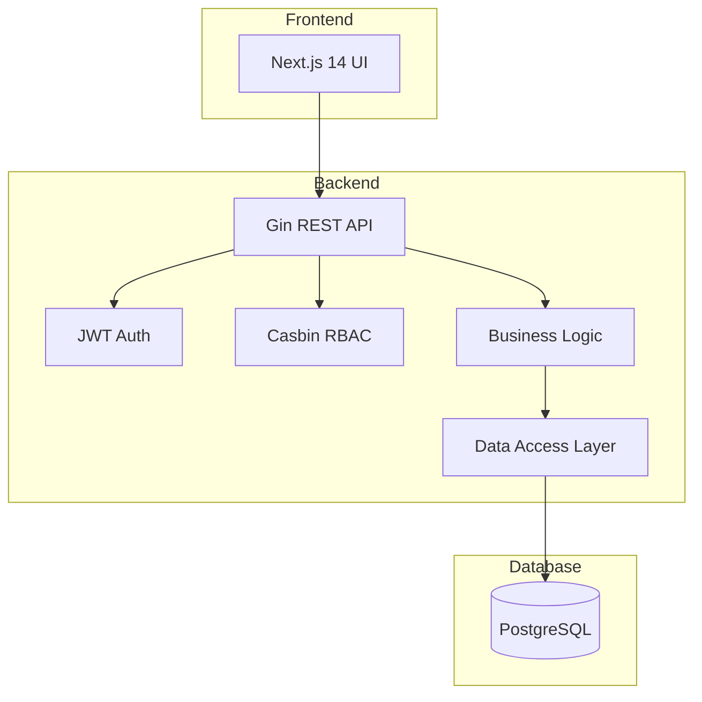

KitaManager Go follows a clean architecture pattern with clear separation of concerns.

## System Overview



## Project Structure

```
kitamanager-go/
├── cmd/api/                 # Application entry point
├── internal/
│   ├── handlers/           # HTTP request handlers
│   ├── models/             # Domain models
│   ├── store/              # Data access layer
│   ├── service/            # Business logic layer
│   ├── middleware/         # Auth, CORS, logging
│   ├── rbac/               # Role-based access control
│   ├── database/           # Database connectivity
│   ├── config/             # Configuration management
│   └── seed/               # Test data seeding
├── frontend/               # Next.js React application
├── docs/                   # Documentation
└── configs/                # Configuration files
```

## Technology Stack

### Backend

| Technology | Purpose |
|------------|---------|
| Go 1.25 | Primary language |
| Gin | HTTP web framework |
| GORM | ORM for database access |
| Casbin | Authorization engine |
| JWT | Authentication tokens |
| Swagger | API documentation |

### Frontend

| Technology | Purpose |
|------------|---------|
| Next.js 14 | React framework |
| TypeScript | Type-safe JavaScript |
| Tailwind CSS | Styling |
| Radix UI | Component library |
| TanStack Query | Data fetching |
| Zustand | State management |

### Infrastructure

| Technology | Purpose |
|------------|---------|
| PostgreSQL | Primary database |
| Docker | Containerization |
| GitHub Actions | CI/CD |

## RBAC Architecture

The application uses a hybrid RBAC system:

1. **Database** stores user-role-organization assignments (auditable, queryable)
2. **Casbin** stores role-permission mappings (optimized policy evaluation)

### Role Hierarchy

| Role | Scope | Permissions |
|------|-------|-------------|
| Superadmin | Global | Full system access |
| Admin | Organization | Full org access |
| Manager | Organization | Operational access |
| Member | Organization | Read-only access |

### Organization-Scoped Resources

Resources that belong to an organization use URL patterns:

```
/api/v1/organizations/{orgId}/employees
/api/v1/organizations/{orgId}/children
/api/v1/organizations/{orgId}/sections
```

## Data Flow

1. **Request** arrives at Gin router
2. **Middleware** handles authentication and authorization
3. **Handler** validates input and calls service layer
4. **Service** implements business logic
5. **Store** performs database operations
6. **Response** is serialized and returned
