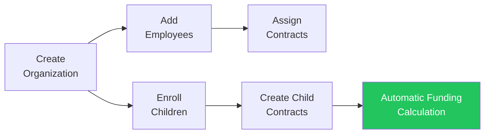
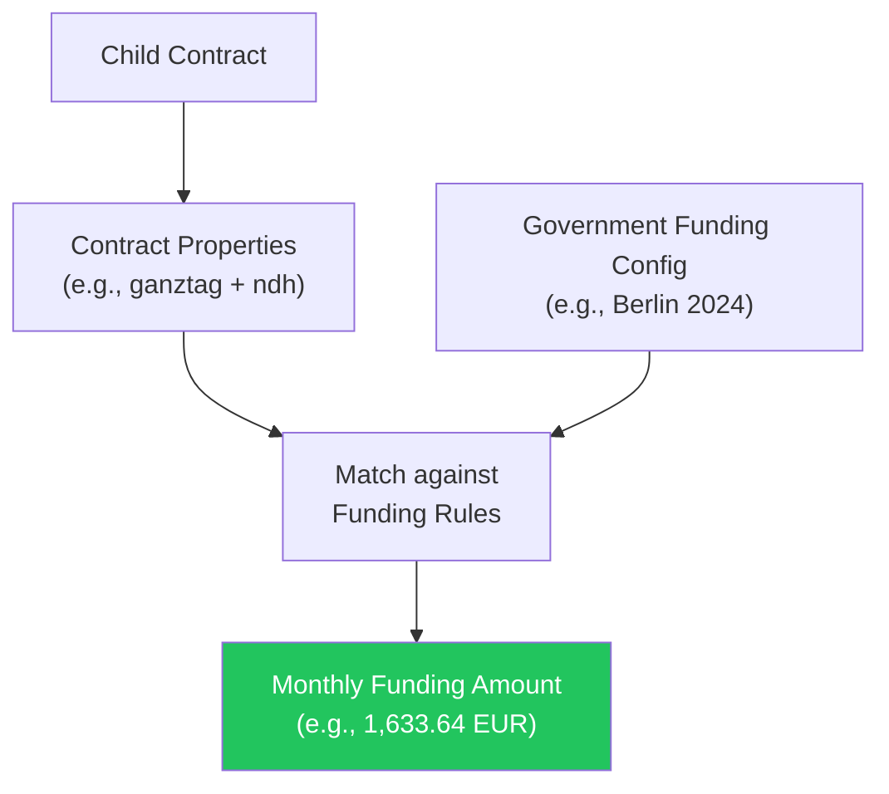

KitaManager Go is a web-based management platform built for daycare centers (Kitas) in Germany. It helps facility administrators handle the daily operational tasks — from tracking which children are enrolled and under what contract, to managing employee records and automatically calculating government funding amounts.

## How It Works

A typical workflow in KitaManager looks like this:

1. **Set up your organization** — register your Kita with its name and German state (Bundesland).
2. **Add staff** — enter employee details, assign positions, and create employment contracts.
3. **Enroll children** — register children with personal data and create care contracts.
4. **Funding is calculated automatically** — based on the child's contract properties (care type, hours, special needs) and the state-level funding rules.

---

## Organization Management

Each Kita is represented as an **organization** in the system. If you operate multiple facilities, each one gets its own organization with completely separate data.

| Capability | Description |
|---|---|
| Multi-facility support | Run several Kitas from a single KitaManager instance |
| Data isolation | Children, employees, and contracts are scoped to their organization |
| State configuration | Each organization is assigned a German state, which determines applicable funding rules |
| Groups and sections | Organize children and staff into groups within the facility |

Administrators see all their organizations on a single overview page and can switch between them using the sidebar.

---

## Employee Management

The employee module lets you maintain a complete personnel database for each Kita.

### What you can track per employee

| Field | Example |
|---|---|
| Name, gender, birthdate | Anna Mueller, Female, May 6 2000 |
| Position | Erzieher, Kinderpfleger, Gruppenleitung |
| Pay grade and step | S8a / Step 3 |
| Weekly hours | 39 hours |
| Contract period | Jan 1, 2024 — Dec 31, 2025 |

### Employment contracts

Each employee can have one or more **employment contracts** over time. Contracts define the position, grade, weekly hours, and validity period. The system enforces that contracts for the same employee do not overlap.

### Pay plans

Pay plans define the salary grades and steps used in your facility (e.g., the TVoeD-SuE pay scale commonly used in German public childcare). When you assign a grade and step to an employee's contract, the system tracks their progression.

---

## Child Enrollment

The child management module tracks every child enrolled in your Kita, along with their care contracts and funding.

### What you can track per child

| Field | Example |
|---|---|
| Name, gender, birthdate | Laura Lange, Female, Mar 27 2025 |
| Current contract status | Active, Upcoming, or Ended |
| Care properties | halbtag, ganztag, teilzeit, integration, ndh |
| Calculated monthly funding | 1,215.45 EUR |

### Care contracts

Each child has one or more **care contracts** that define the period of enrollment and the type of care received. Contract properties are key-value tags that describe the care arrangement:

| Property | Meaning |
|---|---|
| `halbtag` | Half-day care |
| `ganztag` | Full-day care |
| `teilzeit` | Part-time care |
| `ndh` | Non-German-speaking household (nichtdeutsche Herkunftssprache) |
| `integration a/b` | Integration support levels |

These properties directly determine how much government funding the Kita receives for each child (see [Government Funding](#government-funding) below).

---

## Government Funding

One of KitaManager's core features is the automatic calculation of government childcare funding based on each German state's rules.

### How funding calculation works

1. Each child's contract has **properties** describing their care type.
2. The system looks up the matching **funding entry** from the configured state funding rules.
3. The resulting **monthly amount** is displayed directly in the children list.

### Funding configuration

Funding is configured per German state and per time period. Each funding entry maps a combination of properties to a monthly amount in euros:

| Properties | Monthly Amount |
|---|---|
| halbtag | 1,215.45 EUR |
| halbtag + ndh | 1,318.11 EUR |
| ganztag | 1,909.61 EUR |
| ganztag + integration a | 3,566.41 EUR |
| teilzeit + ndh | 1,633.64 EUR |

Funding periods can be updated when state rates change without affecting historical data.

---

## User Roles and Access Control

KitaManager uses a role-based access control (RBAC) system to ensure that users can only access data appropriate to their role and organization.

### Role overview

| Role | Scope | Can manage employees | Can manage children | Can manage funding | Can manage users |
|---|---|---|---|---|---|
| **Superadmin** | All organizations | Yes | Yes | Yes | Yes |
| **Admin** | Assigned org(s) | Yes | Yes | Yes | Yes |
| **Manager** | Assigned org(s) | Yes | Yes | No | No |
| **Member** | Assigned org(s) | Read only | Read only | No | No |

- **Superadmin** is the system-wide administrator who can manage all organizations and users.
- **Admin** has full control within one or more assigned organizations.
- **Manager** handles day-to-day operations like managing employees and children.
- **Member** can view data but cannot make changes.

All data modifications are tracked in an audit log for compliance purposes.

---

## Dashboard and Reporting

After logging in, users see a **dashboard** that provides a quick overview of their Kita:

- Total number of organizations, employees, children, and users
- Quick stats scoped to the currently selected organization
- One-click navigation to all management areas via the sidebar

The sidebar provides direct access to:

| Menu Item | Purpose |
|---|---|
| Dashboard | Overview and key metrics |
| Organizations | Manage Kita facilities |
| Government Fundings | Configure state funding rules |
| Users | User account management |
| Groups | Manage organizational groups |
| Employees | Staff database and contracts |
| Children | Enrollment and care contracts |
| Statistics | Reporting and data analysis |
| Pay Plans | Salary grade definitions |
