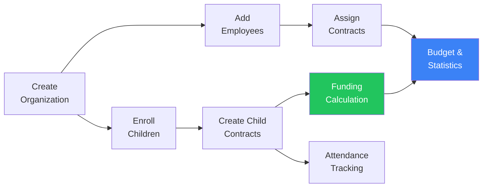
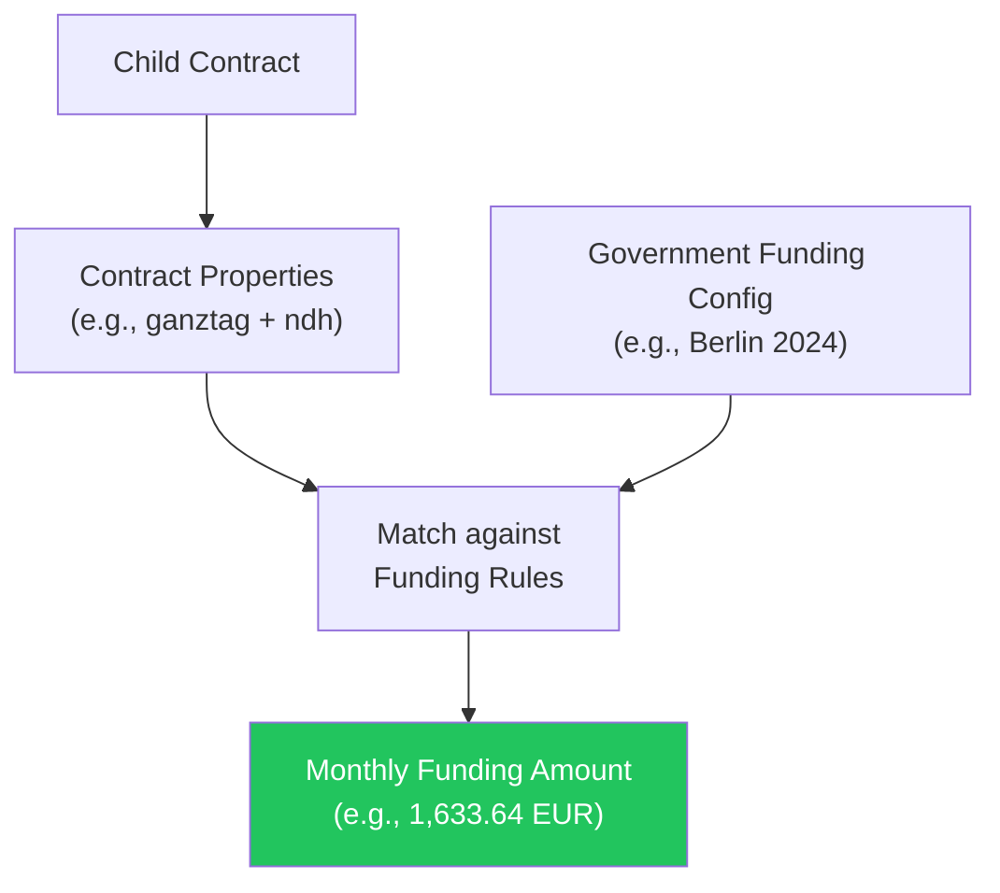

KitaManager is a web-based management platform built for daycare centers (Kitas) in Germany. It helps facility administrators handle daily operational tasks — from employee records and child enrollment to government funding calculations, attendance tracking, budget management, and reporting.

## How It Works

A typical workflow in KitaManager follows these steps:

1. **Set up your organization** — register your Kita with its name, German state (Bundesland), and sections.
2. **Add staff** — enter employee details, assign positions, and create employment contracts.
3. **Enroll children** — register children with personal data, assign sections, and create care contracts.
4. **Funding is calculated automatically** — based on each child's contract properties and the state-level funding rules.
5. **Track attendance** — record daily attendance for each child.
6. **Monitor finances and statistics** — use budgets, statistics, and reports to manage operations.

---

## Organization Management

Each Kita is represented as an **organization** in the system. If you operate multiple facilities, each one gets its own organization with completely separate data.

| Capability | Description |
|---|---|
| Multi-facility support | Run several Kitas from a single KitaManager instance |
| Data isolation | Children, employees, contracts, and budgets are scoped to their organization |
| State configuration | Each organization is assigned a German state (Bundesland), which determines applicable funding rules |
| Sections | Organize children and staff into groups within the facility |

Administrators see all their organizations on an overview page and can switch between them using the sidebar.

---

## Sections

Sections represent groups within a Kita — for example, "Schmetterlinge" or "Sonnenkafer." They let you organize your facility into manageable units.

| Capability | Description |
|---|---|
| Create named sections | Define groups that reflect your facility's structure |
| Assign children | Place each child into a section for day-to-day grouping |
| Assign employees | Associate staff members with the sections they work in |
| Filter by section | Statistics and reports can be filtered by section |

---

## Employee Management

The employee module maintains a complete personnel database for each Kita.

### What you can track per employee

| Field | Example |
|---|---|
| Name, gender, birthdate | Anna Mueller, Female, May 6, 2000 |
| Position | Erzieher, Kinderpfleger, Gruppenleitung |
| Pay grade and step | S8a / Step 3 |
| Weekly hours | 39 hours |
| Contract period | Jan 1, 2024 — Dec 31, 2025 |

### Employment contracts

Each employee can have one or more **employment contracts** over time. Contracts define the position, grade, step, weekly hours, and validity period. The system enforces that contracts for the same employee do not overlap.

### Step promotions

KitaManager tracks when employees become eligible for the next salary step based on their contract start date and current step. Step promotion alerts appear on the dashboard so administrators can act on upcoming pay changes.

### Import and export

- **Import** employee data from YAML files for bulk onboarding.
- **Export** employee lists to Excel or YAML for reporting and archival.

---

## Child Enrollment

The child management module tracks every child enrolled in your Kita, along with their care contracts and funding.

### What you can track per child

| Field | Example |
|---|---|
| Name, gender, birthdate | Laura Lange, Female, Mar 27, 2023 |
| Voucher number | Unique identifier from the municipality |
| Section | Schmetterlinge |
| Care properties | ganztag, ndh, integration_a |
| Calculated monthly funding | 1,633.64 EUR |

### Care contracts

Each child has one or more **care contracts** that define the period of enrollment and the type of care received. Contract properties describe the care arrangement:

| Property | Meaning |
|---|---|
| `halbtag` | Half-day care |
| `ganztag` | Full-day care |
| `teilzeit` | Part-time care |
| `ndh` | Non-German-speaking household (nichtdeutsche Herkunftssprache) |
| `mss` | MSS supplement |
| `integration_a` | Integration support level A |
| `integration_b` | Integration support level B |

These properties directly determine how much government funding the Kita receives for each child (see [Government Funding](#government-funding) below).

### Import and export

- **Import** child data from YAML files for bulk enrollment.
- **Export** child lists to Excel or YAML.

---

## Attendance Tracking

KitaManager provides daily attendance tracking for every child in your facility.

| Capability | Description |
|---|---|
| Weekly grid view | See and edit attendance for all children in a week-at-a-glance layout |
| Attendance statuses | Mark children as present or absent for each day |
| Per-child history | View the full attendance record for an individual child |
| Organization-wide summary | See attendance totals across the entire facility |
| Staff role access | Users with the **staff** role can record and update attendance directly |

Attendance data is scoped to the organization and can be reviewed by section.

---

## Government Funding

One of KitaManager's core features is the automatic calculation of government childcare funding based on each German state's rules.

### How funding calculation works

1. Each child's contract has **properties** describing their care type.
2. The system looks up the matching **funding entry** from the configured state funding rules.
3. The resulting **monthly amount** is displayed directly in the children list.

### Funding configuration

Funding is configured per German state and per time period. Each funding entry maps a combination of properties to a monthly amount in euros:

| Properties | Monthly Amount |
|---|---|
| halbtag | 1,215.45 EUR |
| halbtag + ndh | 1,318.11 EUR |
| ganztag | 1,909.61 EUR |
| ganztag + integration_a | 3,566.41 EUR |
| teilzeit + ndh | 1,633.64 EUR |

Funding periods can be updated when state rates change without affecting historical data.

### ISBJ bill comparison

KitaManager supports uploading government funding bills in the **ISBJ format**. After upload, the system compares the billed amounts against its own calculated funding to identify discrepancies — helping you catch underpayments or errors before they compound.

---

## Budget Management

The budget module lets you plan and track income and expenses for your Kita.

| Capability | Description |
|---|---|
| Budget items | Create categories for income and expenses (e.g., "Staff Costs", "Material Purchases", "Parent Fees") |
| Time-bound entries | Add entries with amounts and validity periods to each budget item |
| Spending tracking | Monitor actual spending against planned budgets |
| Organization-scoped | Each organization maintains its own independent budget |

---

## Statistics and Reporting

KitaManager provides seven types of statistics to support operational decisions. All statistics pages offer print-friendly views and can be filtered by date range and section.

| Statistic | What it shows |
|---|---|
| **Staffing Hours** | Total weekly hours across all employee contracts |
| **Financials** | Revenue and cost summaries based on funding and pay plan data |
| **Occupancy** | Number of enrolled children relative to capacity |
| **Employee Staffing Details** | Per-employee breakdown of hours, grade, and step |
| **Age Distribution** | Children grouped by age bracket |
| **Contract Property Distribution** | Breakdown of care types and supplements across child contracts |
| **Funding Overview** | Summary of calculated funding amounts by property combination |

---

## Pay Plans

Pay plans define the salary grades and steps used in your facility — typically based on the **TVoeD-SuE** pay scale used in German public childcare.

| Capability | Description |
|---|---|
| Grades and steps | Define salary tables with grades (e.g., S3, S8a, S8b) and steps (1–6) |
| Monthly amounts | Set gross monthly pay for each grade/step combination |
| Multiple periods | Create separate pay plan periods when rates change (e.g., annual adjustments) |
| Employer contribution rates | Configure employer-side social contribution percentages |
| Import/Export | Import and export pay plan definitions via YAML |

When you assign a grade and step to an employee's contract, the system uses the active pay plan to calculate costs and track step progression.

---

## User Roles and Access Control

KitaManager uses a role-based access control (RBAC) system to ensure users can only access data appropriate to their role and organization.

### Role overview

| Role | Scope | Description |
|---|---|---|
| **Superadmin** | All organizations | Full system access. Can create and delete organizations, manage all resources globally. |
| **Admin** | Assigned org(s) | Full control within assigned organizations. Can manage employees, children, funding, users, and sections. |
| **Manager** | Assigned org(s) | Operational access. Can manage employees, children, and contracts. Read-only access to users, groups, and sections. |
| **Member** | Assigned org(s) | Read-only access to employees, children, contracts, and sections. |
| **Staff** | Assigned org(s) | Read-only access to children, contracts, and sections. Full CRUD on attendance. Designed for teachers and assistants. |

### Permission matrix

| Resource | Superadmin | Admin | Manager | Member | Staff |
|---|---|---|---|---|---|
| Organizations | Full CRUD | Read + Update | Read | Read | Read |
| Employees | Full CRUD | Full CRUD | Full CRUD | Read | - |
| Employee Contracts | Full CRUD | Full CRUD | Full CRUD | Read | - |
| Children | Full CRUD | Full CRUD | Full CRUD | Read | Read |
| Child Contracts | Full CRUD | Full CRUD | Full CRUD | Read | Read |
| Child Attendance | Full CRUD | Full CRUD | Full CRUD | - | Full CRUD |
| Sections | Full CRUD | Full CRUD | Read | Read | Read |
| Users | Full CRUD | Full CRUD | Read | - | - |
| Groups | Full CRUD | Full CRUD | Read | - | - |
| Pay Plans | Full CRUD | Full CRUD | Read | Read | - |
| Fundings | Full CRUD | Full CRUD | - | - | - |

### Audit logging

All data modifications are recorded in an audit log. Every create, update, and delete action is tracked with the acting user, timestamp, and affected resource — ensuring accountability and compliance.

---

## Dashboard

After logging in, users see a dashboard that provides a quick overview of their Kita.

| Feature | Description |
|---|---|
| Organization summary | Total counts of organizations, employees, children, and users |
| Step promotion alerts | Notifications when employees become eligible for their next salary step |
| Upcoming children | Children with enrollment start dates in the near future |
| Section age alerts | Warnings when children in a section approach age thresholds |

The sidebar provides direct access to all management areas: organizations, employees, children, attendance, government funding, statistics, budgets, pay plans, sections, and user management.

---

## Import and Export

KitaManager supports bulk data operations through YAML import and Excel/YAML export.

| Resource | YAML Import | Excel Export | YAML Export |
|---|---|---|---|
| Children | Yes | Yes | Yes |
| Employees | Yes | Yes | Yes |
| Pay Plans | Yes | - | Yes |
| Government Funding Rates | Yes | - | - |

Imports validate data before committing, and exports produce files ready for offline analysis or archival.

---

## Mobile-Friendly Design

KitaManager is built with a responsive layout that works across devices. The interface adapts to phones, tablets, and desktops with touch-friendly controls and appropriately sized tap targets.

| Viewport | Min Width | Optimized For |
|---|---|---|
| Phone | 375px | Single-column layouts, essential data visible |
| Tablet | 768px | Two-column layouts, full table views |
| Desktop | 1024px+ | Full multi-column layouts with all details |

Teachers and staff can use KitaManager on tablets during their workday — for example, recording attendance directly from the group room.

---

## Multi-Language Support

The interface is available in **English** and **German**, switchable at any time from the navigation bar. All labels, messages, and validation errors are translated.

KitaManager also supports **dark mode**, which can be toggled in the UI for comfortable use in any lighting condition.
